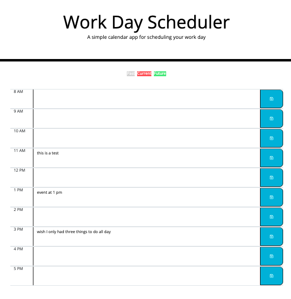

# Work Day Scheduler

This is a simple calendar application that allows a user to save events for each hour of the day. 

This app is built using HTML, CSS, and jQuery. 

The github link for this repository is: https://github.com/ailict/workday-scheduler

This website is deployed live at: https://ailict.github.io/workday-scheduler/

Screenshot of deployed application:

